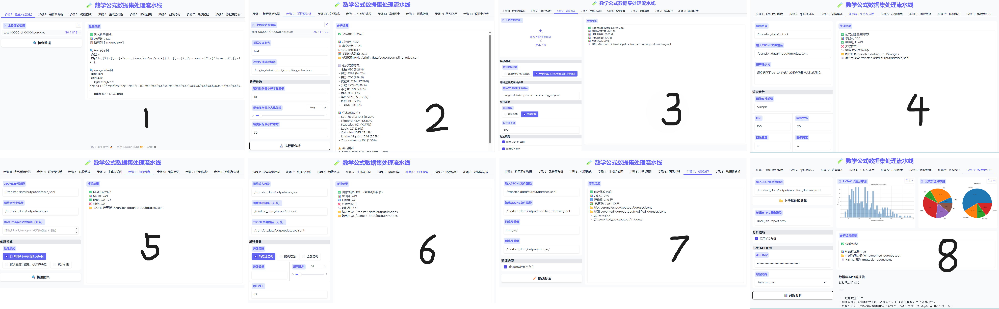

# Formula Dataset Pipeline

一个轻量级、端到端的合成数学公式数据集生成流水线，专为构建公式识别数据集（Mathematical Expression Recognition / Math OCR）任务设计。

> ✨ **无需安装系统级 LaTeX！仅依赖 `matplotlib` 渲染公式图像，开箱即用。支持最多10K数据**  
> 已在 **Python 3.11** 环境下验证通过。
---

## 项目结构

本项目采用三阶段工作流，确保数据质量与流程清晰：

```text
formula-dataset-pipeline/
├── demo.py                         # 图形交互界面
├── origin_data/
│   ├── check.py                    # 检查原始数据列名与内容
│   └── convert.py                  # 提取、转换为 jsonl (id和latex标签)
├── transfer_data/
│   ├── generate_formula_images.py  # 生成透明背景公式图
│   └── compare.py                  # 人工核验后清理无效样本
└── worked_data/
    ├── enhance_image.py            # ±5° 随机旋转增强
    └── modify_image_paths.py       # 修正图像路径  
```

## 快速上手

安装部署：
1. git clone https://github.com/6big/formula-dataset-pipeline.git
2. pip install -r requirements.txt
3. python demo.py ————>浏览器自动打开界面



最终生成：
- `worked_data/images/`：增强后的 PNG 公式图像（透明背景）  
- `worked_data/add_train.jsonl`：与图像严格对应的标注文件，格式如下：

```json
{"image": "images/000001.png", "latex": "x = \\frac{-b \\pm \\sqrt{b^2 - 4ac}}{2a}"}
```

## 环境要求

- Python 3.11  
- 仅需 Python 库依赖（见 `requirements.txt`）  
- 无需安装任何系统级 LaTeX 发行版（如 TeX Live、MiKTeX）  

> 公式渲染完全由 `matplotlib` 的 mathtext 引擎处理，纯 Python 实现，跨平台兼容。

## 注意事项：mathtext 的 LaTeX 支持范围

`matplotlib` 的 mathtext 支持绝大多数标准数学符号，但不支持：

- 自定义宏（如 `\newcommand`）  
- 复杂排版环境（如 `align`、`gather`）  
- `\text{}` 命令（建议改用 `\mathrm{}`）  

✅ 完全支持的示例：

- `x = \frac{a}{b}`  
- `\sqrt{x^2 + y^2}`  
- `\sum_{i=1}^n x_i`  
- `\int_0^\infty e^{-x^2} dx`  

> 如果原始数据包含不支持的语法，`generate_formula_images.py` 会提示。 `convert.py` 阶段已做过滤。

## 📚 引用本项目

如果你在研究、论文或产品中使用了本项目，欢迎引用！这将帮助更多人发现和受益于本工作。

### BibTeX 引用（推荐）

```bibtex
@software{6big_formula_dataset_pipeline_2025,
  author = {6big},
  title = {{Formula Dataset Pipeline}},
  url = {https://github.com/6big/formula-dataset-pipeline},
  version = {1.0},
  date = {2025-09-24}
}
```
### 文本引用格式
```text
6big. (2025). Formula Dataset Pipeline [Computer software]. GitHub. https://github.com/6big/formula-dataset-pipeline
```
